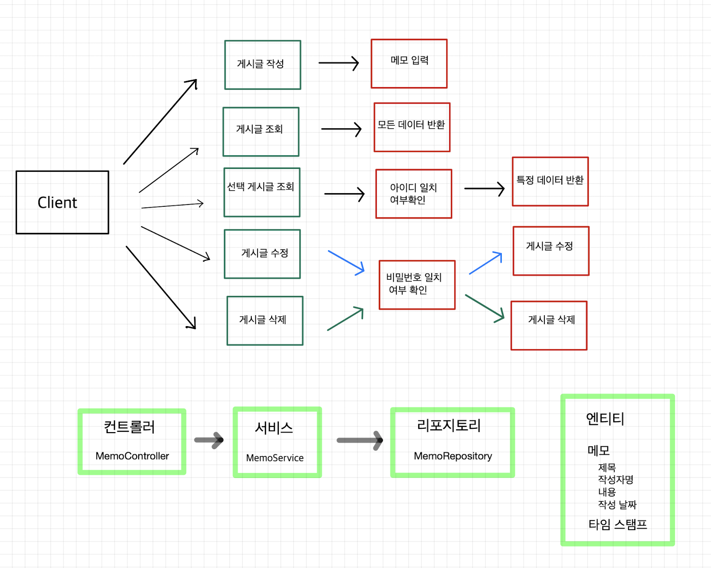

## 과제 주의사항
1. Entity를 그대로 반환하지 말고 DTO에 담아서 반환
2. API를 이용해서 JSON 타입으로 반환

## 서비스 요구사항
- [x] 전체 게시글 목록 조회
	1. 제목, 작성자명, 작성 내용, 작성 날짜 조회
	2. 작성 날짜 기준 내림차순
- [x] 게시글 작성 API (월)
	1. 제목, 작성자명, 비밀번호, 작성 내용 저장
	2. 저장된 게시글 Client로 반환
- [ ] 선택한 게시글 조회 API 
	1. 선택한 게시글의 제목, 작성자명, 작성 날짜, 작성 내용 조회
- [ ] 선택한 게시글 수정 API (화)
	1. 수정 요청시 수정할 데이터와 비밀번호를 같이 보내서 일치여부 확인
	2. 제목, 작성자명, 작성 내용을 수정해서 Client로 반환
- [ ] 선택한 게시글 삭제 API (수)
	1. 삭제 요청시 비밀번호를 같이 보내서 비밀번호 일치여부 확인
	2. 삭제 후 성공 표시 반환

## Use Case


## API 명세서
| Function         | Method | URL           |
| ---------------- | ------ | ------------- |
| 게시글 작성      | POST   | /api/post     |
| 게시글 전체 조회 | GET    | /api/serchAll |
| 특정 게시글 조회 |        |               |
| 게시글 수정      |        |               |
| 게시글 삭제      |        |               |
|                  |        |               |
### 작성 (POST)
- Requset
```
{
	 "name" : name,
	 "title" : title,
	 "description" : description,
	 "password" : password
}
```
- Response
```
{
	"id" : id
	"name" : name,
	 "title" : title,
	 "description" : description,
	 "password" : password
	 "createAt" : 20xx.mm.nn
}
```

### 전체 조회 (GET)
- Requset
```

```
- Response
```
{
	"id" : id
	"name" : name,
	 "title" : title,
	 "description" : description,
	 "password" : password
	 "createAt" : 20xx.mm.nn
}
```


### 
- Requset
```

```
- Response
```

```


## 찾아볼 내용

- final을 붙이는 이유?
- @RequiredArgsConstructor
- DTO에 담아서 반환?


## 트러블 슈팅
### 23/02/06
1. JPA 관련해서 오류발생하면서 Spring 서버 띄우기 실패

오류 : BeanCreationException
해결방법 : 다 지우고 다시 처음부터 하나씩 입력하면서 실행해봄
MemoRepository 인터페이스 만들고 JPARepository 연결하니 같은 에러 발생
문제점을 둘러보다 Memo 엔티티 클래스에 @Entity대신 @Setter 어노테이션 붙어있는거 확인
그래서 JPA가 Mem 객체를 넣는데 인식을 못해서 나온 오류로 추정
결론 : 신중하게 어노테이션 붙이자.

2. PostMan API 테스트 이슈

오류 : 데이터를 입력하는데 오류 발생
원인분석 : 이전에 만들어놓은 프로그램에서도 오류가 발생하는 것을 보니 PostMan 사용법 문제라고 판단
해결방법 : PostMan 사용법검색.
문제점 : JSON 타입으로 데이터를 POST해야 하는데 쿼리형태로 전송하고 있었음. 전송 데이터 타입을 JSON형식으로 바꿔서 해결

3. Memo저장시 NullPointException 발생

오류 : NullPointException
원인분석 : `memoRepository.save()`를 지우고 memo객체를 반환해보니 데이터가 전부 null인것을 확인.
해결방법 : 강의 프로젝트와 내 자료 비교
문제점 : MemoController에서 데이터를 받아올 때 JSON 형식을 매개변수로 받으려면 @RequestBody를 붙여줘야 하는데 그냥 MemoDto에 냅다 받아버림. @RequestBody를 붙여서 해결.

4. 다시 NullPointException..

오류 : NullPointException
원인분석 : JSON으로 입력한 값을 입력이 됐는데 자동으로 입력되는 id값이 값이 초기화가 안돼서 save과정 NullPointException이 발생한 것으로 추정	
해결방법 : 강의 프로젝트와 내 자료 비교
문제점 : `private final MemoRepository memoRepository` 
private final을 안붙여서 생긴 오류
이유 : `@RequiredArgsConstructor`어너테이션은 `final`또는`@NotNull`이 붙은 생성자를 자동 생성해주는 어너테이션이다. 그래서 final이 붙지않은 MemoRepository를 생성하지 못했고 거기서 문제가 발생해서 NullPointException이 발생한 것으로 추정. 좀 더 확인이 필요.

5. 생성날짜 NullPointException..

오류 : NullPointException
원인 분석 : 이전 TimeStamped 클래스 파일을 복사해서 넣어도 문제 발생 확인. 다른 부분에서 시간을 읽는 곳이 있고 거기가 문제라고 판단
해결 방법 : `@EntityListeners(AuditingEntityListener.class)` 구글링
문제점 : `@EnableJpaAuditing` 안붙임
이유 : HangHaeBlogApplication에서 실행할 때 JPA Auditing을 활성화 해야하는데 그걸 `@EnableJpaAuditing`가 해준다. 저 어너테이션이 없어서 활성화가 안됐고 null값이 뜬것이다.

___

