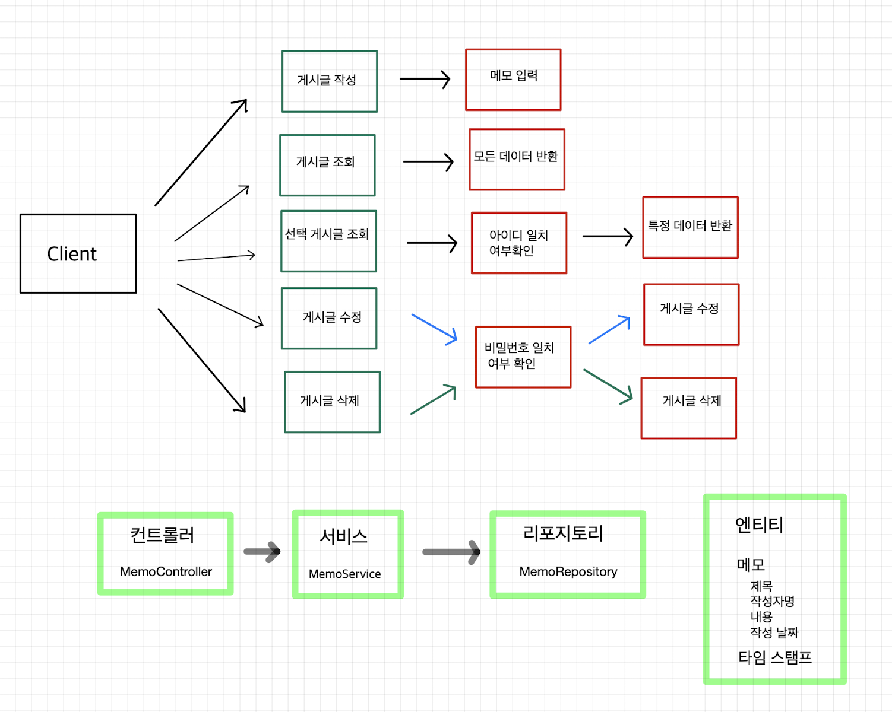

## 과제 주의사항
1. Entity를 그대로 반환하지 말고 DTO에 담아서 반환
2. API를 이용해서 JSON 타입으로 반환

## 서비스 요구사항
- [x] 전체 게시글 목록 조회
	1. 제목, 작성자명, 작성 내용, 작성 날짜 조회
	2. 작성 날짜 기준 내림차순
- [x] 게시글 작성 API (월)
	1. 제목, 작성자명, 비밀번호, 작성 내용 저장
	2. 저장된 게시글 Client로 반환
- [x] 선택한 게시글 조회 API 
	1. 선택한 게시글의 제목, 작성자명, 작성 날짜, 작성 내용 조회
- [ ] 선택한 게시글 수정 API (화)
	1. 수정 요청시 수정할 데이터와 비밀번호를 같이 보내서 일치여부 확인
	2. 제목, 작성자명, 작성 내용을 수정해서 Client로 반환
- [ ] 선택한 게시글 삭제 API (수)
	1. 삭제 요청시 비밀번호를 같이 보내서 비밀번호 일치여부 확인
	2. 삭제 후 성공 표시 반환

## Use Case


## API 명세서
| Function         | Method | URL            |
| ---------------- | ------ | -------------- |
| 게시글 작성      | POST   | /api/post      |
| 게시글 전체 조회 | GET    | /api/serchAll  |
| 특정 게시글 조회 | GET    | /api/post/{id} |
| 게시글 수정      | PUT    | /api/post/{id} |
| 게시글 삭제      | DELETE | /api/post/{id} |

### 작성 (POST)
- Requset
```
{
	 "author" : author,
	 "title" : title,
	 "content" : content,
	 "password" : password
}
```
- Response
```
id
```

### 전체 조회 (GET)
- Requset
```

```
- Response
```
{ 
	{ 
	"createdAt": "2022-07-25T12:43:01.226062”, 
	"modifiedAt": "2022-07-25T12:43:01.226062”, 
	"id": 1, 
	"title": "title2", 
	"content": "content2", 
	"author": "author2" 
	}, 
	{ 
	"createdAt": "2022-07-25T12:43:01.226062”,
	 "modifiedAt": "2022-07-25T12:43:01.226062”,
	  "id": 2, 
	  "title": "title", 
	  "content": "content", 
	  "author": "author" 
	} 
	… 
}
```


### 특정 id 게시물 조회 (GET)
- Requset
```
{
	
}
```
- Response
```
{ 
	"createdAt": "2022-07-25T12:43:01.226062”,
	 "modifiedAt": "2022-07-25T12:43:01.226062”, 
	 "id": 1,
	"title": "title2", 
	"content": "content2",
	 "author": "author2"
}
```

### 수정 (PUT)
- Requset
```
{ 
	"author" : author,
	 "title" : title,
	 "content" : content,
	 "password" : password
}
```
- Response
```
{ 
	"createdAt": "2022-07-25T12:43:01.226062”, 
	"modifiedAt": "2022-07-25T12:43:01.226062”, 
	"id": 1, "title": "title2", 
	"content": "content2", 
	"author": "author2" 
}
```

### 삭제 (DELETE)
- Requset
```
{ 
	"password" :"password"
}
```
- Response
```
{ 
	"success": true, 
}
```


## 찾아볼 내용

- final을 붙이는 이유?
- @RequiredArgsConstructor
- DTO에 담아서 반환?


## 트러블 슈팅
### 23/02/06
1. JPA 관련해서 오류발생하면서 Spring 서버 띄우기 실패

오류 : BeanCreationException
해결방법 : 다 지우고 다시 처음부터 하나씩 입력하면서 실행해봄
MemoRepository 인터페이스 만들고 JPARepository 연결하니 같은 에러 발생
문제점을 둘러보다 Memo 엔티티 클래스에 @Entity대신 @Setter 어노테이션 붙어있는거 확인
그래서 JPA가 Mem 객체를 넣는데 인식을 못해서 나온 오류로 추정
결론 : 신중하게 어노테이션 붙이자.

2. PostMan API 테스트 이슈

오류 : 데이터를 입력하는데 오류 발생
원인분석 : 이전에 만들어놓은 프로그램에서도 오류가 발생하는 것을 보니 PostMan 사용법 문제라고 판단
해결방법 : PostMan 사용법검색.
문제점 : JSON 타입으로 데이터를 POST해야 하는데 쿼리형태로 전송하고 있었음. 전송 데이터 타입을 JSON형식으로 바꿔서 해결

3. Memo저장시 NullPointException 발생

오류 : NullPointException
원인분석 : `memoRepository.save()`를 지우고 memo객체를 반환해보니 데이터가 전부 null인것을 확인.
해결방법 : 강의 프로젝트와 내 자료 비교
문제점 : MemoController에서 데이터를 받아올 때 JSON 형식을 매개변수로 받으려면 @RequestBody를 붙여줘야 하는데 그냥 MemoDto에 냅다 받아버림. @RequestBody를 붙여서 해결.

4. 다시 NullPointException..

오류 : NullPointException
원인분석 : JSON으로 입력한 값을 입력이 됐는데 자동으로 입력되는 id값이 값이 초기화가 안돼서 save과정 NullPointException이 발생한 것으로 추정
해결방법 : 강의 프로젝트와 내 자료 비교
문제점 : `private final MemoRepository memoRepository` 
private final을 안붙여서 생긴 오류
이유 : `@RequiredArgsConstructor`어너테이션은 `final`또는`@NotNull`이 붙은 생성자를 자동 생성해주는 어너테이션이다. 그래서 final이 붙지않은 MemoRepository를 생성하지 못했고 거기서 문제가 발생해서 NullPointException이 발생한 것으로 추정. 좀 더 확인이 필요.

5. 생성날짜 NullPointException..

오류 : NullPointException
원인 분석 : 이전 TimeStamped 클래스 파일을 복사해서 넣어도 문제 발생 확인. 다른 부분에서 시간을 읽는 곳이 있고 거기가 문제라고 판단
해결 방법 : `@EntityListeners(AuditingEntityListener.class)` 구글링
문제점 : `@EnableJpaAuditing` 안붙임
이유 : HangHaeBlogApplication에서 실행할 때 JPA Auditing을 활성화 해야하는데 그걸 `@EnableJpaAuditing`가 해준다. 저 어너테이션이 없어서 활성화가 안됐고 null값이 뜬것이다.

___
### 23/02/07
1. MemoDto 생성자 오류
```java
public MemoDto(Memo memo) {  
    this.name = memo.getName();  
    this.title = memo.getTitle();  
    this.description = memo.getDescription();  
    this.password = memo.getPassword();  
}
```
오류 : InvalidDefinitionException    
원인 분석 : MemoDto에 위의 생성자를 입력하면 Spring서버 구동은 되고 GET도 작동하지만 POST를 날리면 에러가 발생했다. 그래서 POST 과정에서 문제가 있을거라고 판단.   
해결 방법 : MemoDto에 기본 생성자 생성.    
문제점 : `public Long post(@RequestBody MemoDto memoDto)` 여기서 문제가 있다고 판단했다. MemoDto 객체에 정보를 담으려면 객체를 생성해야하는데 생성자가 없으면 기본 생성자를 만들어주기때문에 위의 생성자를 넣지 않았을 때는 정상적으로 작동했다. 하지만 위의 생성자를 넣으면 기본 생성자를 만들어주지 않으므로 POST 요청을 받아올 때 객체를 생성하지 못한다. 그래서 기본 생성자를 넣으면 작동이 되는 것이다.

2. Memo 업데이트 오류   

오류 : 업데이트 내용이 DB에 저장이 안됨.
원인 분석 : 메모의 변경사항을 저장하지 않아서 그냥 저장 되는구나 했는데 내가 만든 프로젝트에서는 변경까지는 성공했지만 다시 조회해보면 이전 데이터 그대로였다. 그래서 과제 내용과 내 프로젝트를 비교해봤다.
해결방법 : MemoService의 `update()`메서드에 `@Transactional` 붙이기.
문제점   
> JPA의 1차 캐시 (transactional write-behind)

JPA의 영속성  
영속성 컨텍스트란 엔티티를 영구 저장하는 환경이다. 애플리케이션과 DB사이에 위치한다.  
>> 1차캐시?   

영속성 컨텍스트의 내부에 엔티티를 보관하는 저장소.  
항상 데이터베이스에 접근해서 데이터를 가져오는 것은 비효율적이다. 필요한 데이터는 메모리에 잠시 저장해두고 요청이 들어오면 메모리의 값을 가지고 가는 것이 훨씬 효율적이다. 그 역할을 하는 요소가 1차 캐시다.  
**특징**
- 최초 조회시에는 1차 캐시에 데이터가 없으므로 DB에서 가져온다.
- 가져올 때 1차 캐시에 저장하고 데이터를 준다.  
- 이후에는 1차 캐시에 있는 데이터의 요청이 들어오면 1차 캐시에서 준다.  
- save시 엔티티를 1차 캐시에 저장한다.  

정리하자면 값읇 불러오거나 변경을하면 우선 1차캐시에 데이터가 저장이 된다.  
> 그럼 언제 1차캐시에 있는 데이터를 DB에 전송하는가?    

바로 트랜잭션의 커밋이 떨어질 때다.  
트랜잭션이 커밋을 하면 비로소 변경된 데이터들이 1차캐시에서 DB로 전송된다.  
이것을 트랜잭션을 지원하는 쓰기 지연(transactional write-behind)라고 한다.  
&nbsp;
메서드에 `@Transactional` 애너테이션을 붙이면 트랜잭션 처리를한다.  
메서드를 실행하고 이상이 있으면 롤백, 아니면 트랜잭션이 종료되고 커밋을 한다.  
&nbsp;
그러면 왜 수정을 하는데 `@Transactional`이 필요한지 알 수있다.  
`@Transactional`이 없으면 수정된 엔티티는 1차캐시에만 저장된다.  
트랜잭션의 커밋이 없으면 1차캐시의 데이터는 DB로 넘어가지 않는다.  
그래서 엔티티의 변경이 확인은 되지만 DB에 저장이 안된 이유다.  


- [x] 등록시 id JSON 형식으로 응답하기 {"id" : id}
- [x] 수정시 수정된 데이터 반환
- [x] 삭제시 JSON 형태로 반환 {"Success" : true}


> Why: 과제 제출시에는 아래 질문을 고민해보고 답변을 함께 제출해주세요.  

1.  수정, 삭제 API의 request를 어떤 방식으로 사용하셨나요? (param, query, body)

수정에서 id는 query를 사용했고 title,content,author,password는 body로 요청을 보냈다.  
삭제도 id는 query를 사용했고 password는 body로 요청을 보냈다.  
2.  어떤 상황에 어떤 방식의 request를 써야하나요?


3.  RESTful한 API를 설계했나요? 어떤 부분이 그런가요? 어떤 부분이 그렇지 않나요?

CRUD를 구현하는데 각각 적절한 Http Method를 사용하였다. 
URL도 api/post/ 경로에 필요하면 id값을 pathVariable로 받았다.  
데이터는 모두 JSON으로 반환하기는 했지만 좋은 코드라고는 생각하지 않는다.  
원하는 값만 반환하려고 하다보니 코드가 직관적이지 못하다. 
4.  적절한 관심사 분리를 적용하였나요? (Controller, Repository, Service)

Controller는 요청이 들어오면 필요한 로직을 Service로 위임했고 Service는 유효성 검사를 거친뒤 Repository의 정보를 수정했다. 그리고 필요한 데이터만 Controller에게 넘겨주기 위해 Dto를 사용해서 Controller에게 반환했다.  
5.  API 명세서 작성 가이드라인을 검색하여 직접 작성한 API 명세서와 비교해보세요!

검색해보니 항해에서 제공한 명세서 가이드와 유사하다.  
다만 나는 테이블에 코드를 못넣어서 따로 넣었는데 그 부분이 아쉽다. 
