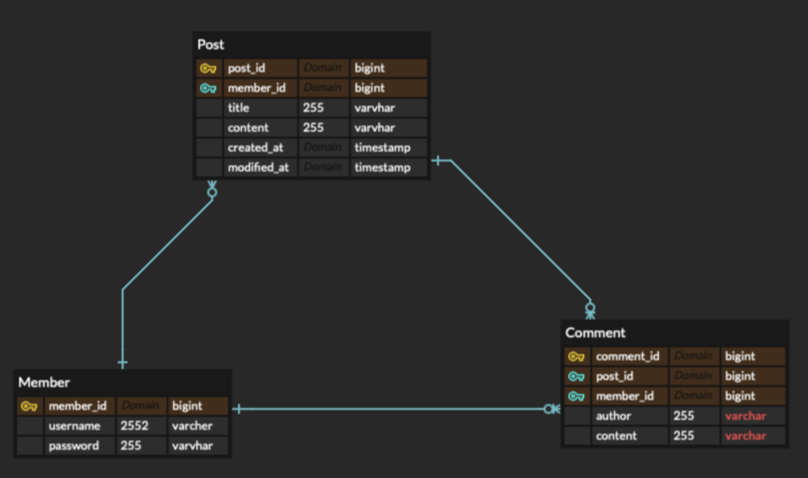

## 요구사항  
1. 요구사항에 맞게 Entity를 설계하고 ERD 만들기  
2. 회원가입 API  
	1. Username,password를 전달받음  
	2. username은 최소 4자 이상, 10자 이하, 알파벳 소문자, 숫자로 구성  
	3. password는 최소 8자 이상, 15자 이하, 알파벳 대소문자, 숫자로 구성  
3. 로그인 API  
	1. Username,password를 전달받음   
	2. DB에서 username 유무 확인하고 password비교  
	3. 로그인 성공 시 JWT토큰 발급  
	4. 헤더에 성공 메시지, 상태코드와 함께 반환하기   

## 요구 수정사항  
1. 전체 게시글 목록 조회 API
	1. 제목, 작성자명, 작성 내용, 작성 날짜 조회하기  
	2. 작성 날짜 기준으로 내림차순 정렬  
2. 게시글 작성 API  
	1. 토큰 검사 후 유효하면 작성 가능  
	2. 제목, 작성자명, 작성 내용 저장  
	3. 저장된 게시글 반환  
3. 선택 게시글 조회 API  
	1. 제목, 작성자명, 작성 날짜, 작성 내용을 조회  
4. 선택 게시글 수정 API  
	1. 토큰 검증 후 유효한 토큰이면 수정 가능  
	2. 제목, 작성 내용을 수정하고 반환  
5. 선택 게시글 삭제 API  
	1. 토큰 검증 후 유효한 토큰이면 수정 가능  
	2. 삭제하고 성공했다는 메시지, 상태코드 반환  

## 요구사항 API 명세서  
| 기능     | URL | Method | Request Header | Request            | Response |  Response Header   | 
| -------- | --- | ------ | -------------- | --------------------------------- | --------- | --- |
| 회원가입 |  /api/auth/signup   |    POST    |                | { </br>"username": "bin1234",</br> "password": "Bin@12345",</br> "admin": "true"</br> } |       { </br>"msg": "회원가입 성공", </br>"statusCode": 200 </br>}   |     |
| 로그인   |  /api/auth/login   |     POST   |                |   {</br> "username": "bin1234", </br>"password": "Bin@12345" </br>}                 |     {</br> "msg": "로그인 성공",</br> "statusCode": 200 </br>}     |   Authorization: Bearer eyJhbGciOiJIUz</br>I1NiJ9.eyJzdWIiOiJiaW4xMjM0IiwiZXhwIjoxNjY5OD</br>cwNDUyLCJpYXQiOjE2Njk4NjY4NTJ9.mm</br>8wgaV8M70hidhPX4Ut6UONZGaxjA1KnOJT1mO59Xc  |

## 요구사항 체크리스트
- [x] 요구사항에 맞게 Entity를 설계하고 ERD 만들기
- [x] 회원가입 API
	- [x] username은 최소 4자 이상, 10자 이하, 알파벳 소문자, 숫자로 구성
	- [x] password는 최소 8자 이상, 15자 이하, 알파벳 대소문자, 숫자로 구성  
	- [x] 헤더에 성공 메시지, 상태코드와 함께 반환하기
- [x] 로그인 API
	- [x] DB에서 username 유무 확인하고 password비교
	- [x] 로그인 성공 시 JWT토큰 발급
	- [x] 헤더에 성공 메시지, 상태코드와 함께 반환하기  

## lv.3 요구사항 추가  
- [x] 회원 권한 부여하기(ADMIN,USER) - ADMIN회원은 모든 게시글, 댓글 수정/삭제 가능  
	- [x] 회원가입시 어드민 / 유저 멤버에 입력  
	- [x] 댓글 수정 / 삭제  
	- [x] 게시글 수정 / 삭제  
		- [x] 멤버에서 userRole 가져오기  
		- [x] Admin이면 AllPass  

## 요구 수정사항 API 명세서  
| 기능             | URL | Method | Request Header | Request | Response | Response Header |
| ---------------- | --- | ------ | -------------- | ------- | -------- | --------------- |
| 게시글 작성 |  /api/post   |  POST   |  Bearer eyJhbGciOiJIU</br>zI1NiJ9.eyJzdWIiOiJiaW4</br>xMjM0IiwiZXhwIjoxNjc2MT</br>gzMzQwLCJpYXQiOjE2NzYxN</br>zk3NDB9.LVPP_5QIi5defwn1</br>QX10mmtwA6RlnsrHJVy_z6cBKIg | { </br>"title": "게시글5", </br>"content": "내용5" </br>} | { </br>"id": 5,</br> "title": "게시글5",</br> "content": "내용5", </br>"username": "bin1234", </br>"createdAt": "2022-12-01T12:56:36.821474",</br>"modifiedAt": "2022-12-01T12:56:36.821474" </br>}  |                 |
| 게시글 목록 조회 |  /api/post   |  GET  |    |         |     {</br>{ </br>"id": 5, </br>"title": "게시글5", </br>"content": "내용5",</br> "username": "bin1234", </br>"createdAt": "2022-12-01T12:56:36.821474", </br>"modifiedAt": "2022-12-01T12:56:36.821474" </br>} </br>,{ </br>"id": 5, </br>"title": "게시글5", </br>"content": "내용5", </br>"username": "bin1234", </br>"createdAt": "2022-12-01T12:56:36.821474", </br>"modifiedAt": "2022-12-01T12:56:36.821474" </br>}</br> }     |                 |
| 게시글 상세 조회 |   /api/post/{id}  |  GET  |   |         |    { </br>"id": 5, </br>"title": "게시글5",</br> "content": "내용5",</br> "username": "bin1234",</br> "createdAt": "2022-12-01T12:56:36.821474",</br> "modifiedAt": "2022-12-01T12:56:36.821474" </br>}       |                 |
| 게시글 수정 |  /api/post/{id}   |  PUT  | Bearer eyJhbGciOiJIU</br>zI1NiJ9.eyJzdWIiOiJiaW4</br>xMjM0IiwiZXhwIjoxNjc2MT</br>gzMzQwLCJpYXQiOjE2NzYxN</br>zk3NDB9.LVPP_5QIi5defwn1</br>QX10mmtwA6RlnsrHJVy_z6cBKIg |   {</br> "title": "게시글5", </br>"content": "내용5" </br>}     |    {</br> "id": 5, </br>"title": "게시글5", </br>"content": "내용5", </br>"username": "bin1234", </br>"createdAt": "2022-12-01T12:56:36.821474", </br>"modifiedAt": "2022-12-01T12:56:36.821474" </br>}       |                 |
| 게시글 삭제 |  /api/post/{id}   |  DELETE  | Bearer eyJhbGciOiJIU</br>zI1NiJ9.eyJzdWIiOiJiaW4</br>xMjM0IiwiZXhwIjoxNjc2MT</br>gzMzQwLCJpYXQiOjE2NzYxN</br>zk3NDB9.LVPP_5QIi5defwn1</br>QX10mmtwA6RlnsrHJVy_z6cBKIg |         |  {</br> "msg": "게시글 삭제 성공",</br> "statusCode": 200 </br>}  |                 |

## ERD  
  

## 요구 수정사항 체크리스트  
- [x]  전체 게시글 목록 조회 API 
	- [x]  제목, 작성자명, 작성 내용, 작성 날짜 조회하기 
	- [x]  작성 날짜 기준으로 내림차순 정렬 
- [x] 게시글 작성 API 
	- [x] 토큰 검사 후 유효하면 작성 가능 
	- [x] 제목, 작성자명, 작성 내용 저장 
	- [x] 저장된 게시글 반환 
- [x] 선택 게시글 조회 API  
	- [x] 제목, 작성자명, 작성 날짜, 작성 내용을 조회 
- [x] 선택 게시글 수정 API 
	- [x] 토큰 검증 후 유효한 토큰이면 수정 가능 
	- [x] 제목, 작성 내용을 수정하고 반환 
- [x] 선택 게시글 삭제 API 
	- [x] 토큰 검증 후 유효한 토큰이면 수정 가능 
	- [x] 삭제하고 성공했다는 메시지, 상태코드 반환 


## 트러블 슈팅  
1. @RequestBody 없으면 null 값 저장  
2. RestControllerAdvice

## 미해결  
- [x] findByUsername ?  
- [ ] @Slf4j  
- [ ] 토큰 검사 시 else 후에 예외처리가 필요한가?  
- [x] 아이디 중복 확인  
- [ ] post 리턴하면 왜 스택오버플로우?? 
- [x] findAllByOrderByModifiedAtDesc()   


## lv.3 요구사항  
- [x] 댓글 작성 API  
	- [x] 토큰을 검사하여 유효한 토큰일 경우 댓글 작성 가능  
	- [x] 게시글이 DB에 있는지 유무 확인  
	- [x] 게시글이 있다면 댓글을 등록하고 댓글 반환  
- [x] 댓글 수정 API  
	- [x] 토큰을 검사하여 유효한 토큰일 경우 댓글 작성 가능  
	- [x] 댓글이 DB에 저장 유무 확인  
	- [x] 댓글이 있다면 댓글을 등록하고 등록된 댓글 반환  
- [x] 댓글 삭제 API 
	- [x] 토큰을 검사하여 유효한 토큰일 경우, 해당 사용자일 경우 삭제 가능  
	- [x] 댓글의 DB 저장 유무  
	- [x] 댓글이 있다면 삭제하고 성공 메시지, 상태코드 반환  
- [x] 예외처리  
	- [x] 토큰 x 또는 정상 토큰이 아닌 경우 "토큰이 유효하지 않습니다." 라는 에러메시지와 statusCode: 400  
	- [x] 토큰 o, 유효하지만 해당 사용자의 글이 아닌경우 “작성자만 삭제/수정할 수 있습니다.”라는 에러메시지와 statusCode: 400  
	- [x] 이미 존재하는 username으로 회원가입 하는 경우 "중복된 username 입니다." 라는 에러메시지와 statusCode: 400  
	- [x] 로그인시 username과 password가 맞지 않다면 "회원을 찾을 수 없습니다."라는 에러메시지와 statusCode: 400을 Client  


## lv.3 요구사항 API 명세서  
| 기능      | URL                         | Method | Request Header                                                                                                                                                        | Request                                                    | Response                                                                             | Response Header |
| --------- | --------------------------- | ------ | --------------------------------------------------------------------------------------------------------------------------------------------------------------------- | ---------------------------------------------------------- | ------------------------------------------------------------------------------------ | --------------- |
| 댓글 작성 | /api/comment/{id}           | POST   | Bearer eyJhbGciOiJIU</br>zI1NiJ9.eyJzdWIiOiJiaW4</br>xMjM0IiwiZXhwIjoxNjc2MT</br>gzMzQwLCJpYXQiOjE2NzYxN</br>zk3NDB9.LVPP_5QIi5defwn1</br>QX10mmtwA6RlnsrHJVy_z6cBKIg | {</br>"author" : "author",</br> "content", "content"</br>} | {</br>"comment", "comment",</br>"author" : "author",</br> "content", "content"</br>} |                 |
| 댓글 수정 | /api/comment/{comment} | PUT    | Bearer eyJhbGciOiJIU</br>zI1NiJ9.eyJzdWIiOiJiaW4</br>xMjM0IiwiZXhwIjoxNjc2MT</br>gzMzQwLCJpYXQiOjE2NzYxN</br>zk3NDB9.LVPP_5QIi5defwn1</br>QX10mmtwA6RlnsrHJVy_z6cBKIg | {</br>"author" : "author",</br> "content", "content"</br>} | {</br>"comment", "comment",</br>"author" : "author",</br> "content", "content"</br>}                           |                 |
| 댓글 삭제 | /api/comment/{comment} | DELETE | Bearer eyJhbGciOiJIU</br>zI1NiJ9.eyJzdWIiOiJiaW4</br>xMjM0IiwiZXhwIjoxNjc2MT</br>gzMzQwLCJpYXQiOjE2NzYxN</br>zk3NDB9.LVPP_5QIi5defwn1</br>QX10mmtwA6RlnsrHJVy_z6cBKIg |                                                            | {</br> "msg": "게시글 삭제 성공",</br> "statusCode": 200 </br>}                      |                 |

## lv.3 수정사항  
- [x] 전체 게시글 조회  
	- [x] 각각의 게시글이 등록된 모든 댓글을 게시글과 같이 Client에 반환하기  
	- [x] 댓글은 작성 날짜 기준 내림차순으로 정렬하기  
- [x] 선택한 게시글 조회  
	- [x] 선택한 게시글에 등록된 모든 댓글을 선택한 게시글과 같이 Client에 반환하기  
	- [x] 댓글은 작성 날짜 기준 내림차순으로 정렬하기  

## lv.4 요구 사항  

- [x] 게시글 작성  
- [x] 게시글 수정  
- [x] 게시글 삭제  
	- [x] Spring Security로 토큰 검사 및 인증하기  
 
## 로그인 없이 접근 허용 범위  
- /api/auth/**
- /api/post/**, GET

## API 명세서  
lv.2랑 같음  

| 기능             | URL            | Method | Request Header                                                                                                                                                        | Request                                                   | Response                                                                                                                                                                                                                                                                                                                                                                                                                     | Response Header |
| ---------------- | -------------- | ------ | --------------------------------------------------------------------------------------------------------------------------------------------------------------------- | --------------------------------------------------------- | ---------------------------------------------------------------------------------------------------------------------------------------------------------------------------------------------------------------------------------------------------------------------------------------------------------------------------------------------------------------------------------------------------------------------------- | --------------- |
| 게시글 작성      | /api/post      | POST   | Bearer eyJhbGciOiJIU</br>zI1NiJ9.eyJzdWIiOiJiaW4</br>xMjM0IiwiZXhwIjoxNjc2MT</br>gzMzQwLCJpYXQiOjE2NzYxN</br>zk3NDB9.LVPP_5QIi5defwn1</br>QX10mmtwA6RlnsrHJVy_z6cBKIg | { </br>"title": "게시글5", </br>"content": "내용5" </br>} | { </br>"id": 5,</br> "title": "게시글5",</br> "content": "내용5", </br>"username": "bin1234", </br>"createdAt": "2022-12-01T12:56:36.821474",</br>"modifiedAt": "2022-12-01T12:56:36.821474" </br>}                                                                                                                                                                                                                          |                 |
| 게시글 목록 조회 | /api/post      | GET    |                                                                                                                                                                       |                                                           | {</br>{ </br>"id": 5, </br>"title": "게시글5", </br>"content": "내용5",</br> "username": "bin1234", </br>"createdAt": "2022-12-01T12:56:36.821474", </br>"modifiedAt": "2022-12-01T12:56:36.821474" </br>} </br>,{ </br>"id": 5, </br>"title": "게시글5", </br>"content": "내용5", </br>"username": "bin1234", </br>"createdAt": "2022-12-01T12:56:36.821474", </br>"modifiedAt": "2022-12-01T12:56:36.821474" </br>}</br> } |                 |
| 게시글 상세 조회 | /api/post/{id} | GET    |                                                                                                                                                                       |                                                           | { </br>"id": 5, </br>"title": "게시글5",</br> "content": "내용5",</br> "username": "bin1234",</br> "createdAt": "2022-12-01T12:56:36.821474",</br> "modifiedAt": "2022-12-01T12:56:36.821474" </br>}                                                                                                                                                                                                                         |                 |
| 게시글 수정      | /api/post/{id} | PUT    | Bearer eyJhbGciOiJIU</br>zI1NiJ9.eyJzdWIiOiJiaW4</br>xMjM0IiwiZXhwIjoxNjc2MT</br>gzMzQwLCJpYXQiOjE2NzYxN</br>zk3NDB9.LVPP_5QIi5defwn1</br>QX10mmtwA6RlnsrHJVy_z6cBKIg | {</br> "title": "게시글5", </br>"content": "내용5" </br>} | {</br> "id": 5, </br>"title": "게시글5", </br>"content": "내용5", </br>"username": "bin1234", </br>"createdAt": "2022-12-01T12:56:36.821474", </br>"modifiedAt": "2022-12-01T12:56:36.821474" </br>}                                                                                                                                                                                                                         |                 |
| 게시글 삭제      | /api/post/{id} | DELETE | Bearer eyJhbGciOiJIU</br>zI1NiJ9.eyJzdWIiOiJiaW4</br>xMjM0IiwiZXhwIjoxNjc2MT</br>gzMzQwLCJpYXQiOjE2NzYxN</br>zk3NDB9.LVPP_5QIi5defwn1</br>QX10mmtwA6RlnsrHJVy_z6cBKIg |                                                           | {</br> "msg": "게시글 삭제 성공",</br> "statusCode": 200 </br>}                                                                                                                                                                                                                                                                                                                                                              |                 |

## 문제점  
- [x] 예외 처리  
	- [x] 원래는 Controller로 예외가 던져졌지만 Security 설정 후 필터가 예외를 받아서 핸들링이 안되는 것으로 추정 
	- [x] 토큰 인증과정을 서비스에서 필터로 이동했기 때문   
	- [x] 필터에서 예외 처리 하기  
- [x] 댓글 달린 게시글은 삭제가 안됨   
	- [x] PK소유 엔티티(Post)에 CascadeType.REMOVE 설정으로 해결

## 공부할 내용  
- [x] 흐름 정리하기  
- [x] 필터 안에서의 예외 처리

### 흐름  
- JwtAuthFilter를 UsernamePasswordAuthenticationFilter이전에 실행  
- JwtAuthFilter
	- response에서 Token을 추출해서 유효성 검사  
		- 유효하지 않으면 에러코드 응답에 입력  
	- 토큰에서 username을 가져와서 SecurityContextHolder 생성  
- SecurityContextHolder
	- username을 가지고 UserDetails 객체 생성  
		- UseDetailsService  
			- 아이디 유효성 검사  
			- UserDetails객체 생성해서 return  
	- JwtUtil에서 principle, credentials, authorities를 담은 UsernamePasswordAuthenticationToken 생성 후 반환  
		- authorities는 userDetails.getAuthorities()을 통해서 입력  
	- 반환된 Authentication(UsernamePasswordAuthenticationToken)을 Context에 저장  


### 예외 처리 (응답)
```java
private void jwtExceptionHandler(
	HttpServletResponse response, 
	String tokenError, HttpStatus value
) {  
    response.setStatus(value.value());  
    response.setContentType("application/json");  
    try {  
        String json = new ObjectMapper()
        .writeValueAsString(new statusResponseDto(
        tokenError, value));  
        response.getWriter().write(json);  
    } catch (Exception e) {  
        log.error(e.getMessage());  
    }  
}
```

> ObjectMapper()  

Jackson 라이브러리에서 제공하는 클래스.  
주요기능은 JSON <-> Java Object 변환
```java
String json = new ObjectMapper()
.writeValueAsString(new statusResponseDto(tokenError, value));  
// statusResponseDto를 JSON으로 변환  
```

> response.getWrite().write(json) 

String으로 반환한 JSON을 응답 바디부에 입력  
`response.setContentType("application/json")` 필수  

### 정리
응답 헤더에 상태, 타입을 입력하고 응답Dto를 JSON타입의 String으로 바꾸고 응답 바디에 입력  